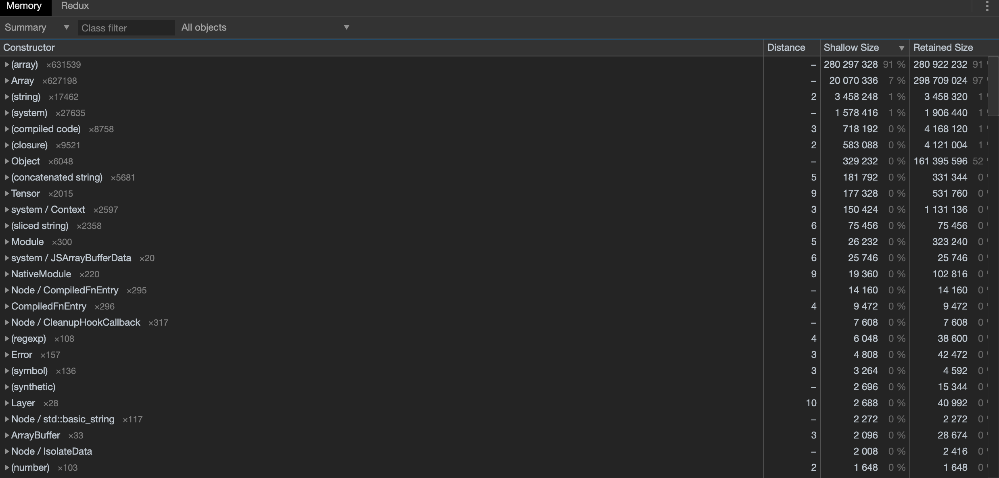
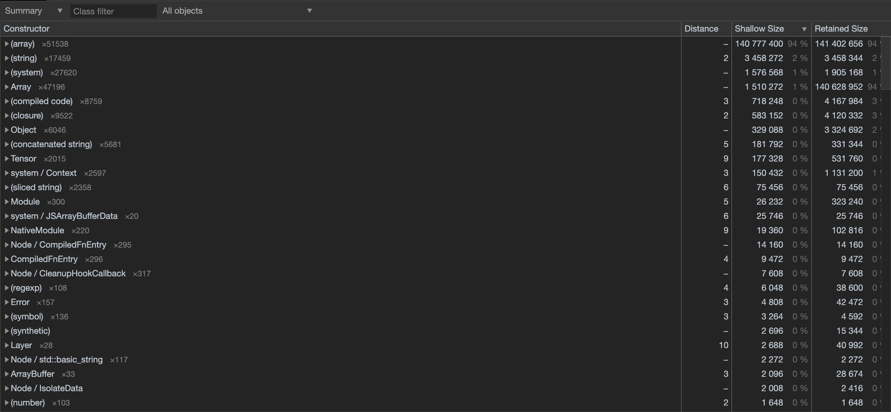
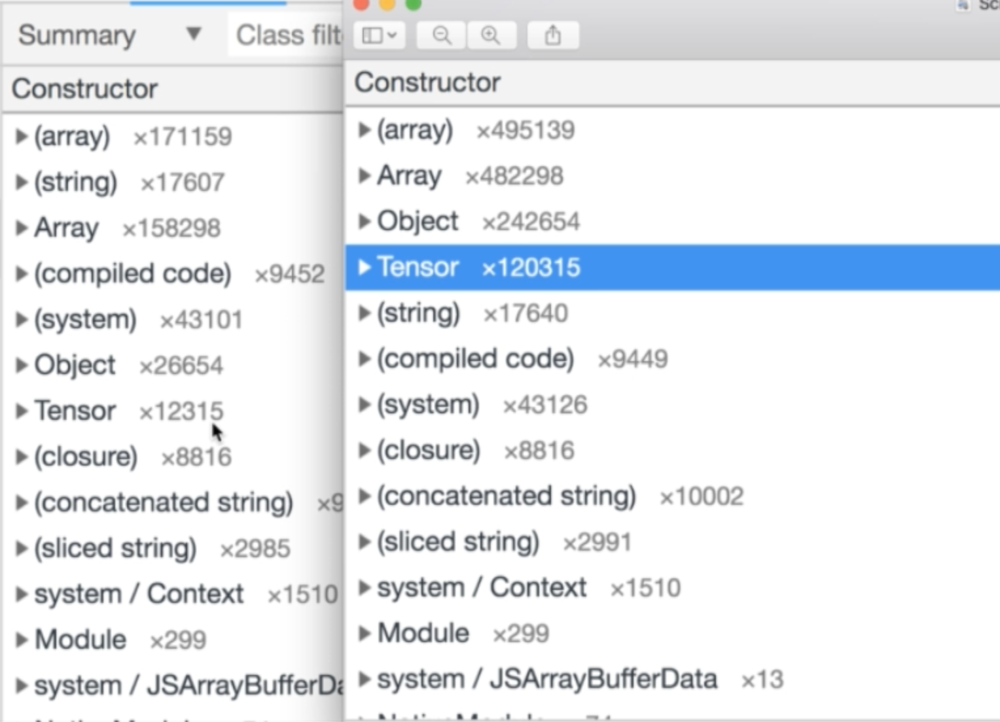

### Handwriting Recognition
* Diagram link: https://app.diagrams.net/#Uhttps://raw.githubusercontent.com/StephenGrider/MLCasts/master/diagrams/13/diagrams.xml
* Diagram 5-mn:
* Diagram 6-mn:

### Greyscale Values
* Diagram 13-image:
* Diagram 11-gs:
* Diagram 7-pixels:

### Many Features
* Diagram 9-vals:
* Diagram 12-features:
* Diagram 13-fea:
* Diagram 6-mn:

### Flattening Image Data
* Copy multinominal to Handwriting and clear up index.js after the require statements
* Require mnist
* Training image data from 0 to 1 non-inclusive
* mnistData.images.values are our pixel values
* It's an array of arrays
* Each inner array denotes a row of pixels
* But we don't to work with a Grid, so we need to flatten it out
* 784 elements in total
* Load up 10 images using (0,10) as arguments to mnist.training

### Encoding Label Values
* Diagram link: https://app.diagrams.net/#Uhttps://raw.githubusercontent.com/StephenGrider/MLCasts/master/diagrams/12/diagrams.xml
* Diagram 7-t:
* Diagram link: https://app.diagrams.net/#Uhttps://raw.githubusercontent.com/StephenGrider/MLCasts/master/diagrams/13/diagrams.xml
* Diagram 14-labels:
* Log out our values by mnistData.labels.values

### Implementing an Accuracy Gauge
* Diagram 6-mnist:
* Increase training to 1000 images

### Unchanging Accuracy
* Increase 1000 to 5000
* Iterations to 20
* Changing parameters and accuracy not showing any change indicates something is very wrong in the algorithm

### Debugging the Calculation Process
* node --inspect-brk index.js
* Open Chrome and navigate to chrome://inspect
* Click on Inspect
* Breakpoint at regression.train
* Click on Blue arrow on top RHS
* Down Arrow to Step into the function
* Step Over till gradientDescent in the train method
* Then in console, type the variable to get its value
```js
batchQuantity
this.labels.print()
this.weights.print()
this.features.print() //The problem is here, where we see it's not a number(NaN)
```
* So let's start debugging at processFeatures
* Close the debugger
* Add **debugger** statement in processFeatures
* Run the same node inspect command
* Unset the previous breakpoint and play and it'll land at processFeatures
* In debugger console
```js
features.print()
//All 0's in top and bottom which makes sense from Diagram 9-val
//Step over to standardize method
//Step into standardize method
mean.print() and variance.print()
features.sub(mean).div(variance.pow(0.5)).print()
//The above line is causing the problem
```
* Diagram link: https://app.diagrams.net/#Uhttps://raw.githubusercontent.com/StephenGrider/MLCasts/master/diagrams/13/diagrams.xml
* Diagram 9-val

### Dealing with Zero Variances
* Diagram 15-options: Possible solutions
```js
const features = tf.tensor([
  [0, 20, 40],
  [0, 20.5, 80],
  [0, 20.3, 90]
])

const {mean, variance} = tf.moments(features, 0);
console.log(variance) or just variance in browser
//Browser we won't see this issue, as this is a different environment than Node
//Browser will automatically turn 0 to 1

//Workaround
variance.cast('bool').logicalNot().cast('float32')

```

### Backfilling Variances
* Remove debugger within processFeatures
* Add filler code in standardize function
* Now accuracy is 0.87 when index.js is run

### Handling Large Datasets
* Easiest way to increase our accuracy is to increase the number in our training data set
* Let's try loading all 60000 images
* Also increase testing pool to 1000
* Takes a lot of time
* Check in Activity Monitor, node memory which is tremendous
* Diagram 16-mem: If node crashes(in my case didn't)
```js
node --max-old-space-size=4096 index.js
```
* Accuracy now 0.876

### Minimizing Memory Usage
* memory.js to test memory usage
* range function creates an array from the first index to not including the last index
* node --inspect-brk memory.js
* Play button till it reaches debugger statement
* Hover over data and can inspect all the elements inside it
* Go to Memory tab->Heap Snapshot->Take Snapshot
* Constructor which gives types of objects created

### Creating Memory Snapshots
* Click on Shallow column twice to sort from largest to smallest
* Shallow size is the bytes used by each of the different objects
* Click on array's 2nd element which shows data in Retainers
* Take a screenshot
* Comment out randoms and rerun the program
* Advance execution to the debugger statement and take a Snapshot
* Array memory from 16MB to 8MB

### The Javascript Garbage Collector
* The memory usage of Array went down significantly after commenting out the return statement
* This is because JS garbage collector
* The Garbage collector kicked in the second time we ran with the commented statement
* randoms holds a reference to the array
* Garbage collector kicks in when there is no longer reference the values that has been created
* Outside of loadData, there is no way to reference the variable randoms
* Diagram link: https://app.diagrams.net/#Uhttps://raw.githubusercontent.com/StephenGrider/MLCasts/master/diagrams/13/diagrams.xml
* Diagram 18-node:
* We had a reference to the big array when randoms was returned and assigned to data
* Diagram 17-mem: When return is commented

### Shallow vs Retained Memory
* Diagram 19-array: Difference between Array and array in Memory tab of debugger
  * Array class or object and the other is the data structure that is actually holding the values
* So size of Array is 32 which is its actual size(Shallow size) and the Retained size is the reference to the actual data structure
* Retained size is the reference to the actual array size

### Measuring Memory Usage
* First thing is to take a Memory snapshot
* In logistic-regression train method, add a debugger statement 
* Why the above location
  * First half of the program's Memory snapshot(First Initial data loading)
* Run node inspect
```sh
node --inspect-brk --max-old-space-size=4096 index.js
```
* Take a Memory snapshot
* Sort by Shallow size by double-clicking it

* Internal array is not relevant to us
* So check *object elements*
* Looks like one of the largest consumers of memory might be features array
* Two entries of values labels and values images of mnist data Object elements
* Brand new features and encodedLabels values with mnistData
* After features and encodedLables are assigned, there is no point to hold *mnistData*

### Releasing References
* Wrap mnistData within a function called loadData

### Measuring Footprint Reduction


### Optimization Tensorflow Memory Usage
* Delete the debugger in train function
* Add debugger right after train call in index.js
* Run node inspect
* Increase training data to 60000
* Take a memory snapshot
* From snapshot, we see 120000 tensors were created

### Tensorflows Eager Memory Usage 
* Diagram link: https://app.diagrams.net/#Uhttps://raw.githubusercontent.com/StephenGrider/MLCasts/master/diagrams/13/diagrams.xml
* Diagram 20-tf: Tensorflow maintains a reference
* In gradientDescent method of linear-regression, the output of matMul is a tensor and applying softmax produces another tensor
* Even though it comes out of the gradientDescent method, the tensorflow still keeps a reference
* Backend digging into tensorflow
```js
tf.ENV.registry.webgl.backend.texData.data
//This returns a WeakMap
```

### Cleaning Up Tensors with Tidy
* Everything gets cleaned up if it's inside tf.tidy except the returned tensor

### Implementing TF tidy
* Wrap everything inside gradientDescent within tf.tidy and assign it to some variable or constant

### Tidying the Training Loop
* Wrap Slices and gradientDescent in train method with tf.tidy
* Return weights from gradientDescent and tf.tidy
* Assign return of tf.tidy to this.weights
* Run node inspect

### Measuring Reduced Memory Usage
* Now Array memory usage drops by 3 times than earlier


### One More Optimization
* In recordCost, wrap up with tf.tidy
* Take one more memory snapshot to check the changes

### Final Memory Report
* Also can check in Activity Monitor of node from 14GB to 1.7GB
